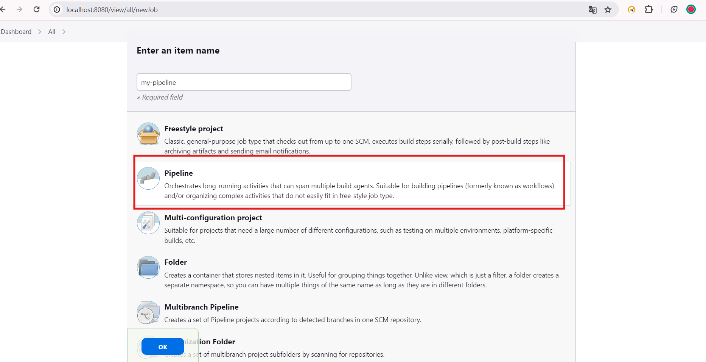
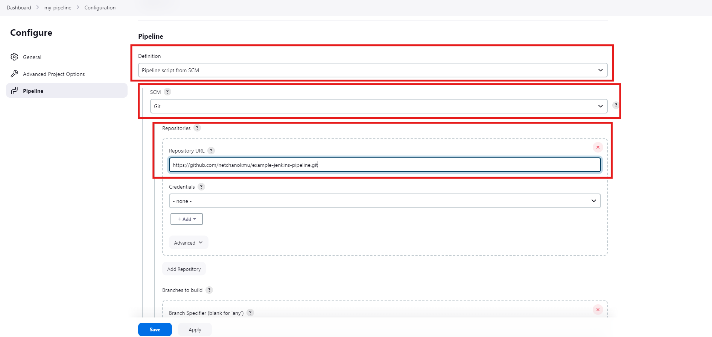
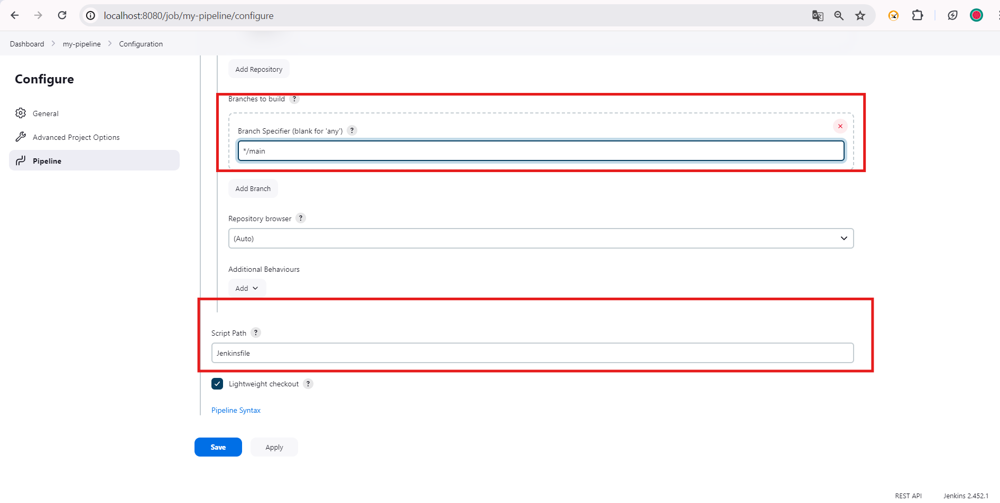
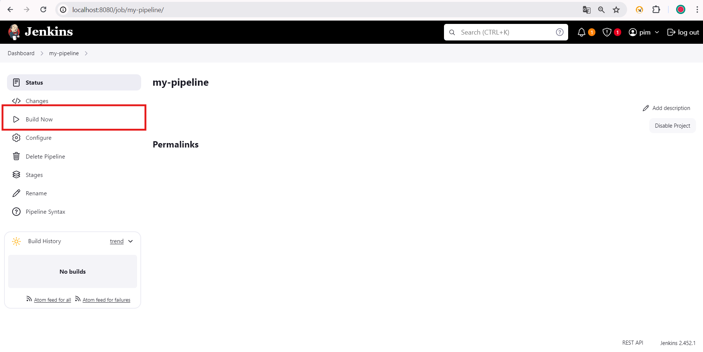
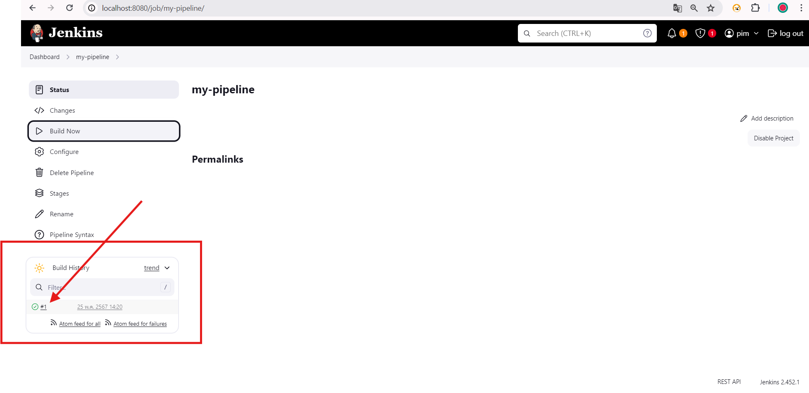
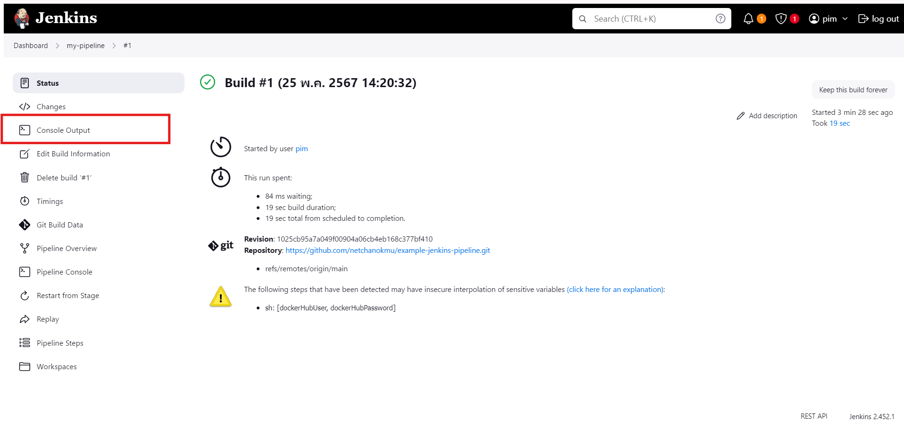
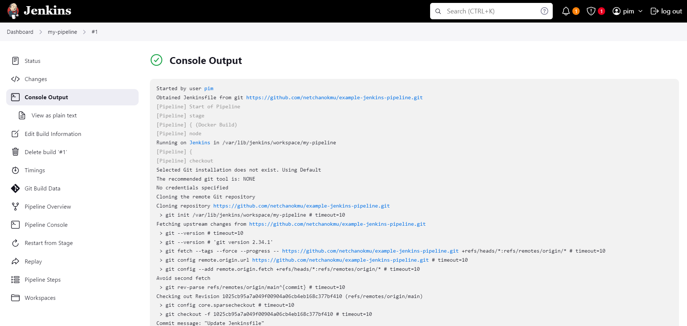
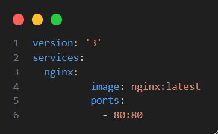
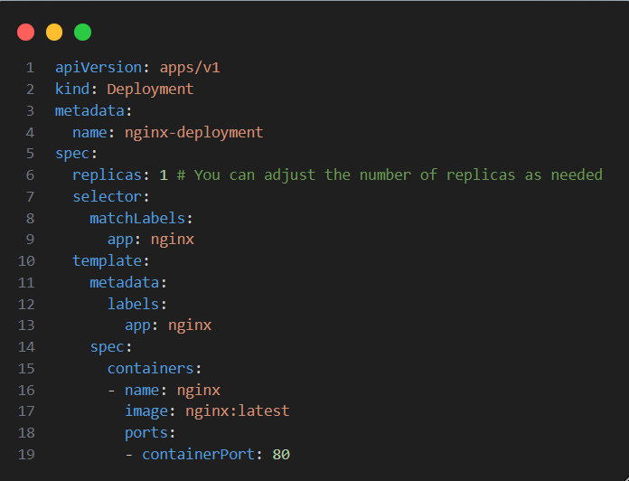
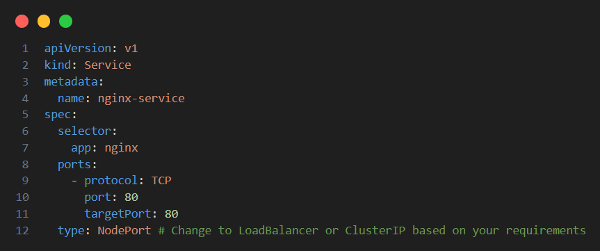

# Q1. Basic Jenkins Pipeline for build,push docker image and deploy image to kubernetes cluster

This is basic example. Can be adjusted according to the environment of the tool

## Step 1: Create pipeline in jenkins

## Step 2: In config page, scroll mouse to pipeline topic, config it and click 'Save' button

## Step 3: Build pipeline and view console output
3.1 Click Build now

3.2 When build finish, will get ...

3.3 Click #1 and click console output 

3.3 Result

# Q2. How to change docker-compose file to kubernetes
## 1. Map "docker-compose" file to the "kubernetes manifest" by manual (เคยทำแค่ 1-2 ครั้ง)
ตัวอย่าง:
### docker-compose

### kubernetes

## 2. Using tools that kube recommend (ยังไม่เคยทำ)
### 2.1 https://kubernetes.io/docs/tasks/configure-pod-container/translate-compose-kubernetes/
### 2.2 https://loft.sh/blog/docker-compose-to-kubernetes-step-by-step-migration/

Kubernetes Vs Docker Compose: https://k21academy.com/docker-kubernetes/docker-compose-vs-kubernetes/
